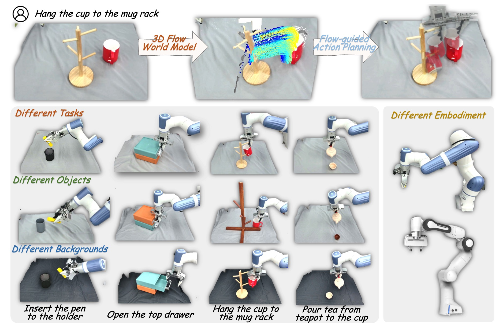

# 3DFlowAction: Learning Cross-Embodiment Manipulation from 3D Flow World Model


This repository contains PyTorch implementation for __3DFlowAction: Learning Cross-Embodiment Manipulation from 3D Flow World Model__ 

[[📖 arXiv]](https://arxiv.org/abs/2506.06199) 
[[🤖 model]]()
[[📑 dataset]]()

## Overview


Manipulation has been a challenging task for robots, a major obstacle is __the lack of a large, uniform dataset for teaching robots manipulation skills__. 
We observe that understanding how objects should move in 3D space is crucial for guiding manipulation actions, and this insight is applicable to both humans and robots. We aim to develop a __3D flow world model__, which predicts the future movement of interacting objects in 3D space to guide action planning.
We also introduce a flow-guided rendering mechanism that predicts the final state and uses GPT-4o to evaluate whether the predicted flow aligns with the task description, enabling __closed-loop planning__ for robots.
The predicted 3D optical flow serves as constraints for an optimization policy that determines the robot's actions for manipulation.  Extensive experiments show __strong generalization__ across diverse robotic tasks and effective __cross-embodiment adaptation__ without hardware-specific training.

## TODO
* [x] Release Moving object detection pipeline for BridgeV2
* [ ] Release ManiFlow-110k
* [ ] Release model weight of 3D Flow World Model
* [ ] Release inference code of 3D Flow World Model
* [ ] Release training code of 3D Flow World Model
* [ ] Release realworld robot implement code 

## Moving object detection pipeline
We use BridgeV2 as an example to generation task-related 3D Flow

### Step0: Install environment requirements
[Cotracker3](https://github.com/facebookresearch/co-tracker), [VideoDepthAnything](https://github.com/DepthAnything/Video-Depth-Anything), [GroundingSam2](https://github.com/IDEA-Research/Grounded-SAM-2)

### Step1: Extract 2D optical flow for manipulated object
``` bash
# Source data structure
BridgeV2-Processed
── depth
│   ├── 0_meter.npz
│   ├── 1_meter.npz
├── frames
│   ├── 0.jpg
│   ├── 1.jpg
├── instructions.txt

# Process
cd preprocess/BridgeV2
python moving_obj_det_pipeline_all.py
```

### Step2: Use VideoDepthAnything to estimate depth of frames and Project the 2D flow to 3D space
